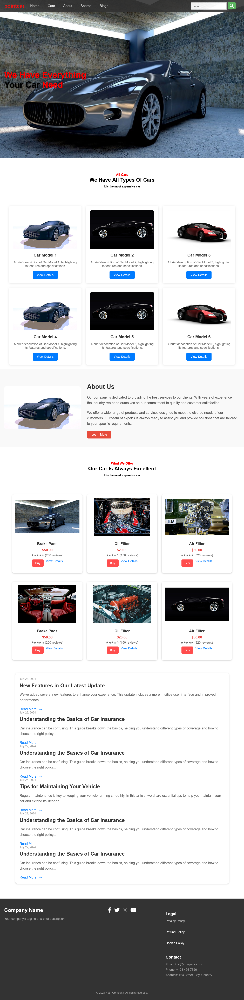

Car Dealership Website

### Desktop View

📌 Overview
A responsive car dealership website built with HTML, CSS, and JavaScript. This project features:

Modern, mobile-first design

Fully responsive layout for all devices

Interactive navigation menu

Vehicle showcase section

Spare parts e-commerce section

Blog/news section

Contact information

🚀 Features
✨ Core Features
Responsive Design: Works flawlessly on mobile, tablet, and desktop

Interactive Elements: Hover effects, mobile menu toggle, and more

Modern UI: Clean, professional aesthetic with attention to detail

Performance Optimized: Lightweight and fast-loading

📱 Responsive Breakpoints
Desktop (≥992px)

Tablet (768px-991px)

Mobile (<768px)

🛠️ Components
Navigation Bar (fixed position)

Hero Section (full-screen banner)

Vehicle Showcase (card-based layout)

About Us Section (image + text)

Spare Parts Shop (product cards)

Blog/News Section

Footer (multi-column layout)

